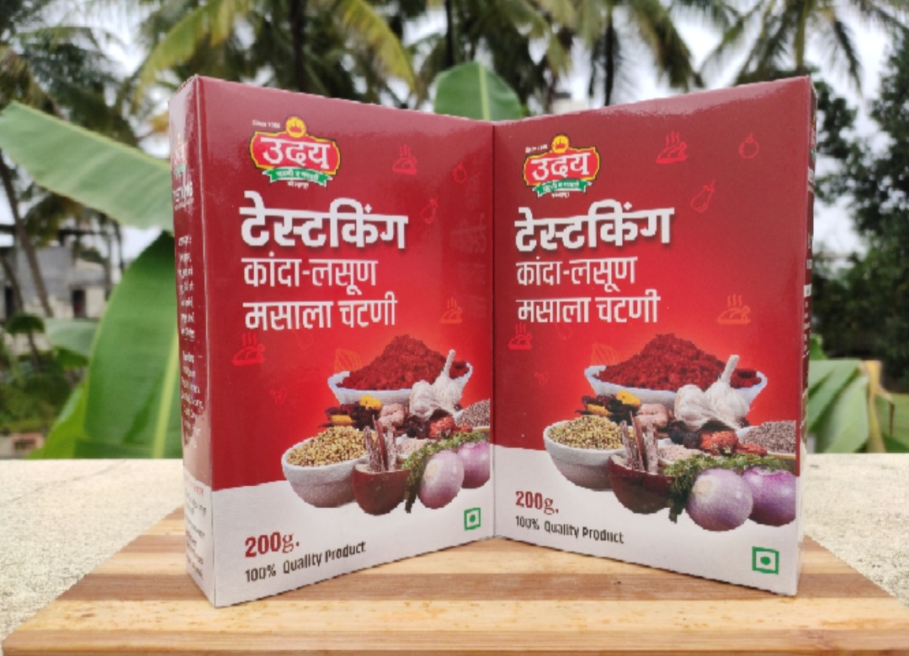

<div align="center">


# 🌶️ UDAY CHUTNEY & MASALE

### **Authentic Kolhapuri Flavours. Made to Spice Up Every Meal.**

A modern digital storefront for a traditional Kolhapuri food brand — bringing authentic Maharashtrian chutneys, masalas and spice blends to the web.

<br>

<a href="https://udaymasale.netlify.app/">

</a>
<a href="https://github.com/CodexxNinja/uday-chutney-masale">

</a>

<br><br>


<br><br>


</div>

---

## ✨ About The Project

**Uday Chutney & Masale** is a modern website created for a Kolhapur-based food business specializing in traditional chutneys, masalas and spice products.

The goal of the project is simple:

> **Preserve the identity of a traditional Maharashtrian food brand while giving it a modern digital presence.**

The website combines traditional Indian food branding with a clean, responsive and mobile-friendly interface.

It allows visitors to:

* Explore the brand and its heritage
* Browse available products
* Discover products by category
* View individual product information
* Learn about the business
* Contact the brand
* Start an order directly through WhatsApp
* Access the website from mobile, tablet or desktop

The live website is deployed using **Netlify** as a lightweight static web application.

---

## 🌶️ The Story Behind The Website

Uday Chutney & Masale represents the traditional flavours associated with **Kolhapur, Maharashtra**.

The website is designed around four major ideas:

```text
Traditional Taste
       ↓
Modern Presentation
       ↓
Easy Product Discovery
       ↓
Simple Customer Ordering
```

Instead of creating a generic e-commerce template, the interface focuses on the identity of the food brand — its products, regional roots, heritage and everyday use.

The website currently highlights the brand's association with Kolhapur and its journey dating back to **1988**.

---

<div align="center">

## 🔥 FROM TRADITION TO DIGITAL


</div>

---

# 🚀 Key Features

<table>
<tr>
<td width="50%">

### 🌶️ Product Showcase

Browse traditional chutneys, masalas, chilli powders and other spice products through a visually focused product interface.

</td>

<td width="50%">

### 📱 WhatsApp Ordering

Customers can move from product discovery to direct WhatsApp ordering without going through a complicated checkout system.

</td>
</tr>

<tr>
<td>

### 🏪 Brand Story

A dedicated About page communicates the brand's background, traditional roots and connection with Kolhapur.

</td>

<td>

### 🔎 Product Discovery

Products can be explored through organized categories, making it easier for customers to find relevant products.

</td>
</tr>

<tr>
<td>

### 📦 Product Details

Dedicated product pages provide a focused experience for individual products.

</td>

<td>

### 📞 Contact

A dedicated contact section provides visitors with a straightforward way to reach the business.

</td>
</tr>

<tr>
<td>

### 📱 Responsive Design

The interface is designed to work across desktop, tablet and mobile screen sizes.

</td>

<td>

### ⚡ Lightweight Architecture

The project uses a static frontend architecture, keeping the website fast and simple to deploy.

</td>
</tr>
</table>

---

# 🖥️ Website Pages

| Page               | Purpose                                  |
| ------------------ | ---------------------------------------- |
| 🏠 `index.html`    | Main landing page and brand introduction |
| 🛍️ `shop.html`    | Product catalogue and product discovery  |
| 🌶️ `product.html` | Individual product information           |
| 📖 `about.html`    | Brand story, heritage and background     |
| 🛒 `checkout.html` | Customer checkout/order flow             |
| 📞 `contact.html`  | Contact and business information         |

---

# 🎨 Design Philosophy

The visual design follows a **food-first + regional-branding** approach.

### Design priorities

```text
             ┌─────────────────────┐
             │   BRAND IDENTITY    │
             └──────────┬──────────┘
                        │
          ┌─────────────┼─────────────┐
          ↓             ↓             ↓
       Products      Heritage       Trust
          │             │             │
          └─────────────┼─────────────┘
                        ↓
               Easy Customer Journey
                        ↓
                 WhatsApp Ordering
```

### Visual direction

* Warm food-oriented visual language
* Product-focused imagery
* Strong regional identity
* Clear typography
* Responsive layouts
* Simple navigation
* Prominent calls-to-action
* Mobile-first customer experience

---

# 🧩 User Journey

The website is structured around a simple customer journey:

```text
                    VISITOR
                       │
                       ▼
                 ┌───────────┐
                 │ Home Page │
                 └─────┬─────┘
                       │
             ┌─────────┴─────────┐
             ▼                   ▼
       Explore Products       Our Story
             │                   │
             ▼                   ▼
        Shop / Category       About Brand
             │
             ▼
       Product Details
             │
             ▼
      Interested in Product?
             │
             ▼
       WhatsApp Ordering
             │
             ▼
           CUSTOMER
```

The flow intentionally reduces unnecessary steps between **discovering a product** and **contacting the business**.

---

# 🛠️ Technology Stack

<div align="center">

| Layer              | Technology                   |
| ------------------ | ---------------------------- |
| Structure          | HTML5                        |
| Styling            | CSS3                         |
| Interactivity      | JavaScript                   |
| Data               | Local project data           |
| Icons / Typography | Web assets & custom graphics |
| Images             | Local image assets           |
| Hosting            | Netlify                      |
| Version Control    | Git + GitHub                 |

</div>

### Why a static architecture?

The current website does not require a complex backend for its primary purpose.

Using a static architecture provides:

* Fast page loading
* Simple deployment
* Low hosting complexity
* Easy maintenance
* Excellent suitability for a small business website
* Straightforward GitHub-based development

---

# 📂 Project Structure

```text
uday-chutney-masale/
│
├── 📁 css/
│   └── Website stylesheets
│
├── 📁 data/
│   └── Product / website data
│
├── 📁 images/
│   ├── 📁 logo/
│   │   └── uday-logo.jpg
│   │
│   ├── 📁 hero/
│   │   └── hero-main.jpg
│   │
│   └── 📁 about/
│       └── about-teaser.jpg
│
├── 📁 js/
│   └── Interactive JavaScript functionality
│
├── 📄 index.html
├── 📄 shop.html
├── 📄 product.html
├── 📄 about.html
├── 📄 checkout.html
├── 📄 contact.html
│
├── 📄 favicon.ico
├── 📄 robots.txt
├── 📄 sitemap.xml
└── 📄 README.md
```

---

# ⚙️ Core Architecture

The project follows a simple frontend architecture:

```text
                    ┌──────────────────┐
                    │      USER        │
                    └────────┬─────────┘
                             │
                             ▼
                 ┌──────────────────────┐
                 │     HTML PAGES       │
                 │                      │
                 │ Home / Shop / About  │
                 │ Product / Contact    │
                 └──────────┬───────────┘
                            │
             ┌──────────────┼──────────────┐
             ▼              ▼              ▼
       ┌──────────┐   ┌──────────┐   ┌──────────┐
       │   CSS    │   │   JS     │   │  DATA    │
       │ Styling  │   │ Logic    │   │ Products │
       └──────────┘   └──────────┘   └──────────┘
             │              │              │
             └──────────────┼──────────────┘
                            ▼
                   ┌────────────────┐
                   │   Responsive   │
                   │   Web UI       │
                   └───────┬────────┘
                           │
                           ▼
                    ┌────────────┐
                    │  Netlify   │
                    └────────────┘
```

---

# 📱 Responsive Experience

The website is designed to adapt to:

```text
┌─────────────────────────────────────────┐
│              DESKTOP                    │
│                                         │
│       Full navigation + product grid    │
│                                         │
└─────────────────────────────────────────┘

              ↓ Responsive ↓

┌───────────────────────────┐
│         TABLET            │
│                           │
│   Adaptive product grid   │
│                           │
└───────────────────────────┘

              ↓ Responsive ↓

┌─────────────────────┐
│       MOBILE        │
│                     │
│   Touch-friendly    │
│   compact layout    │
│                     │
└─────────────────────┘
```

The responsive approach is particularly important because food-product discovery and WhatsApp ordering are highly suitable for mobile users.

---

# 💬 Customer Ordering Flow

One of the main practical features of the project is the direct ordering experience.

```text
Product Discovery
       ↓
Product Details
       ↓
Customer Interest
       ↓
"Order on WhatsApp"
       ↓
WhatsApp
       ↓
Direct Business Conversation
```

This approach avoids requiring a complete payment gateway or enterprise e-commerce backend for the current stage of the website.

---

# 🌐 Deployment

The website is deployed using **Netlify**.

### Live Website

<div align="center">

<a href="https://udaymasale.netlify.app/">


</a>

</div>

### Deployment model

```text
GitHub Repository
       │
       ▼
   Static Files
       │
       ▼
     Netlify
       │
       ▼
  Public Website
       │
       ▼
   Global Users
```

---

# 💻 Run Locally

Because this is a static website, running it locally is straightforward.

### 1. Clone the repository

```bash
git clone https://github.com/CodexxNinja/uday-chutney-masale.git
```

### 2. Enter the project directory

```bash
cd uday-chutney-masale
```

### 3. Open the project

You can simply open:

```text
index.html
```

in your browser.

For development, using **VS Code + Live Server** is recommended.

---

# 🧪 Development Workflow

```text
          ┌───────────────┐
          │ Design Idea   │
          └───────┬───────┘
                  ↓
          ┌───────────────┐
          │ HTML Structure│
          └───────┬───────┘
                  ↓
          ┌───────────────┐
          │ CSS Styling   │
          └───────┬───────┘
                  ↓
          ┌───────────────┐
          │ JavaScript    │
          │ Interaction   │
          └───────┬───────┘
                  ↓
          ┌───────────────┐
          │ Responsive    │
          │ Testing       │
          └───────┬───────┘
                  ↓
          ┌───────────────┐
          │ GitHub        │
          └───────┬───────┘
                  ↓
          ┌───────────────┐
          │ Netlify       │
          └───────────────┘
```

---

# 📈 Current Project Scope

The current version focuses on establishing a strong **digital storefront and brand presence**.

### Current capabilities

* Brand-focused landing page
* Product showcase
* Product categories
* Product details
* Brand story
* Contact page
* Checkout/order flow
* WhatsApp-based ordering
* Responsive design
* Static deployment
* SEO-related files such as sitemap and robots configuration

---

# 🚀 Future Expansion

The current static architecture can later evolve into a full e-commerce platform without completely redesigning the frontend.

### Possible Phase 2

```text
Current Website
      │
      ▼
Product Database
      │
      ▼
Admin Dashboard
      │
      ├── Add Products
      ├── Edit Products
      ├── Inventory
      └── Orders
      │
      ▼
Backend API
      │
      ▼
Customer Accounts
      │
      ▼
Online Cart
      │
      ▼
Payment Gateway
```

### Potential future features

* 🛒 Full shopping cart
* 👤 Customer accounts
* 📦 Order tracking
* 🧾 Digital invoices
* 💳 Online payments
* 📊 Admin dashboard
* 📦 Inventory management
* 🔔 Order notifications
* ⭐ Customer reviews
* ❤️ Wishlist
* 🔍 Advanced product search
* 🏷️ Coupons and discounts
* 📈 Sales analytics
* 📱 Progressive Web App support

These can be added gradually while keeping the current website as the foundation.

---

# 🎯 Project Goals

The project was designed around several practical goals:

### 01 — Digital Presence

Give a traditional local food business a professional online identity.

### 02 — Product Discovery

Make it easier for customers to discover and understand available products.

### 03 — Brand Storytelling

Communicate the heritage and regional identity behind the products.

### 04 — Customer Convenience

Reduce friction between product discovery and contacting the business.

### 05 — Scalability

Create a frontend foundation that can later evolve into a complete e-commerce system.

---

# 🌟 Why This Project Matters

This project demonstrates that a website doesn't always need a complicated technology stack to solve a real business problem.

The application focuses on:

```text
Real Business
     +
Real Products
     +
Real Customers
     +
Simple Technology
     =
Useful Digital Product
```

Rather than being only a practice frontend, the project is structured around the needs of an actual food business.

---

# 🧠 What This Project Demonstrates

From a development perspective, the project demonstrates practical experience with:

* Semantic HTML
* Responsive CSS
* JavaScript-based interaction
* Multi-page website architecture
* Product-oriented UI design
* Local asset management
* Data-driven product presentation
* Customer conversion flows
* WhatsApp integration
* Responsive layouts
* Git/GitHub workflow
* Static website deployment
* Netlify hosting
* Basic SEO structure

---

# 📊 Project Highlights

<div align="center">

|        Area       |        Implementation        |
| :---------------: | :--------------------------: |
|     🌐 Website    | Multi-page static storefront |
|   📱 Responsive   |   Desktop + Tablet + Mobile  |
|    🛍️ Products   |  Product catalogue + details |
|    💬 Ordering    |     WhatsApp integration     |
|    📖 Branding    |    Heritage + storytelling   |
|      🗂️ Data     |    Structured project data   |
|     🚀 Hosting    |            Netlify           |
| 🔧 Source Control |            GitHub            |
|  🧩 Architecture  |    HTML + CSS + JavaScript   |

</div>

---

# 🖼️ Website Preview

<div align="center">

### Home

<a href="https://udaymasale.netlify.app/">

</a>

<br><br>

**Explore the complete website:**

<a href="https://udaymasale.netlify.app/">


</a>

</div>

---

# 📌 Project Information

**Project:** Uday Chutney & Masale Website
**Category:** Business / Food / Product Showcase
**Location:** Kolhapur, Maharashtra, India
**Website Type:** Responsive Static Web Application
**Deployment:** Netlify
**Repository:** GitHub
**Brand Focus:** Traditional Chutneys & Masalas

---

# 🔗 Important Links

<div align="center">

<a href="https://udaymasale.netlify.app/">

</a>

<a href="https://github.com/CodexxNinja/uday-chutney-masale">

</a>

</div>

---

# 👨‍💻 Developer

<div align="center">

### **CodexxNinja**

Building practical web experiences with modern development tools and AI-assisted workflows.

<br>

<a href="https://github.com/CodexxNinja">

</a>

</div>

---

# 📜 License

This project is intended for the **Uday Chutney & Masale website**.

Product images, brand assets, logos and business content belong to their respective owners.

The source code is available on GitHub for development and learning purposes.

---

<div align="center">

## 🌶️ Authentic Taste. Digital Experience.

### **From the heart of Kolhapur to the digital world.**

<br>


<br><br>

**Made with HTML • CSS • JavaScript • GitHub • Netlify**

<br>

<a href="https://udaymasale.netlify.app/">
<strong>🌐 Visit Uday Chutney & Masale</strong>
</a>

</div>
