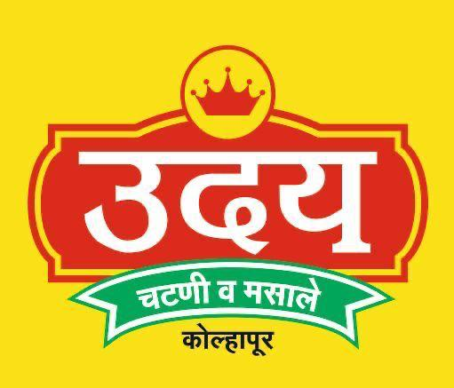

<div align="center">

  <!-- Logo / Header Image Banner -->
  

  # 🌶️ Uday Chutney & Masale
  ### *Authentic Kolhapuri Flavours, Made to Spice Up Every Meal*

  <p align="center">
    Traditional chutneys and masalas crafted for the authentic taste of Maharashtra. Tastemakers since 1988.
  </p>

  <!-- Dynamic Badges -->
  <p align="center">
    <a href="https://udaymasale.netlify.app/">
      
    </a>
    
    
    
  </p>

  <p align="center">
    <a href="#-key-features">Key Features</a> •
    <a href="#-tech-stack">Tech Stack</a> •
    <a href="#-website-structure">Site Structure</a> •
    <a href="#-quick-start">Quick Start</a> •
    <a href="#-contact--ordering">Contact</a>
  </p>

  ---
</div>

## 📌 About The Project

**Uday Chutney & Masale** is a digital storefront designed to bring the rich, fiery, and traditional taste of **Kolhapuri cuisine** directly to households. Operating out of Kolhapur, Maharashtra, this platform showcases premium spice blends, chutneys, and everyday cooking masalas with a smooth, mobile-first ordering experience.

<div align="center">
  
</div>

---

## ✨ Key Features

| Feature | Description |
| :--- | :--- |
| **🌶️ Authentic Product Catalog** | Browse through specialized Kolhapuri masalas, red chili powders, and traditional chutneys. |
| **📱 WhatsApp Ordering** | Direct one-click integration to start an instant order via WhatsApp. |
| **🏬 Category Filtering** | Easily navigate products by category, spice level, or everyday usage. |
| **🏛️ Heritage & Storytelling** | Learn about the brand’s 35+ year journey as a trusted local food enterprise. |
| **⚡ High Performance** | Lightning-fast static deployment powered by Netlify edge servers. |
| **📐 Responsive UI** | Fully optimized for mobile, tablet, and desktop viewports. |

---

## 🛠️ Tech Stack

<div align="center">

| Layer | Technologies Used |
| :--- | :--- |
| **Frontend** |    |
| **Icons & Assets** | Google Fonts, Custom SVG Icons, Responsive Web Graphics |
| **Hosting & CI/CD** |  |

</div>

---

## 📂 Website Structure

```text
uday-masale/
├── 📁 images/
│   ├── 📁 logo/
│   │   └── uday-logo.jpg
│   ├── 📁 hero/
│   │   └── hero-main.jpg
│   └── 📁 about/
│       └── about-teaser.jpg
├── 📄 index.html          # Main landing page
├── 📄 shop.html           # Product showcase catalog
├── 📄 about.html          # Brand story & legacy
├── 📄 contact.html        # Store location & contact info
├── 📁 css/                # Custom stylesheets
└── 📁 js/                 # Interactive site scripts
